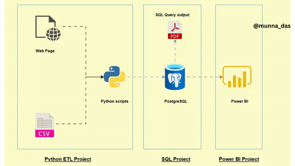

# Uber_ETL Data Analytics

Main source Link: https://github.com/Shyam414/Uber-ETL

# Introduction

Hi Shyam Sundar! The project's objective is to conduct data analytics on the Uber dataset employing a range of tools and technologies, such as Python, PostgreSQL, Power BI, and API tools for data extraction.

## Data_Architecture

## Technology Used
- Programming Language - Python
- Storage - PostgreSQL
- Data Visualization - PowerBI
- deployment - Github

  Data Pipeine : Api-->Postgresql--> Python-->Postgresql-->PowerBI

  
## Dataset Used
TLC Trip Record Data
Yellow and green taxi trip records include fields capturing pick-up and drop-off dates/times, pick-up and drop-off locations, trip distances, itemized fares, rate types, payment types, and driver-reported passenger counts. 

Here is the dataset used in the video - https://raw.githubusercontent.com/Shyam414/Uber-ETL/main/uber_dataset/uber_data.csv

More info about dataset can be found here:
1. Website - https://www.nyc.gov/site/tlc/about/tlc-trip-record-data.page
2. Data Dictionary - https://www.nyc.gov/assets/tlc/downloads/pdf/data_dictionary_trip_records_yellow.pdf

## Data Model

## Data Visualization

